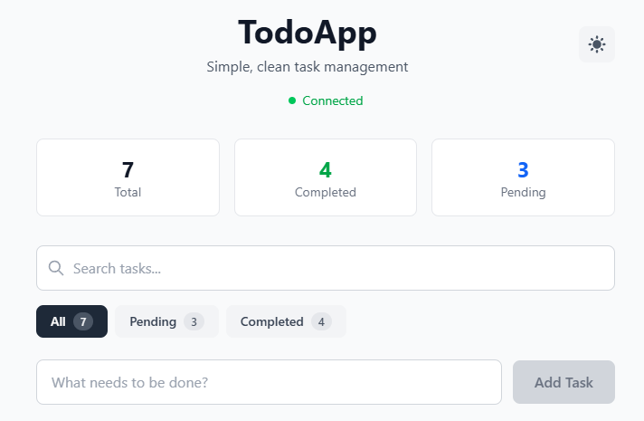

# TodoApp - Full-Stack Task Management Application



A modern, minimalistic todo application built with Next.js, TypeScript, Express, and Tailwind CSS. This project demonstrates clean architecture, separation of concerns, and professional development practices.

## 🚀 Features

- **Create Tasks**: Add new tasks with a clean, intuitive interface
- **Mark Complete**: Toggle task completion status with visual feedback
- **Delete Tasks**: Remove tasks with confirmation dialog
- **Real-time Stats**: View total, completed, and pending task counts
- **🌙 Dark Mode**: Toggle between light and dark themes with system preference detection
- **🔍 Search Tasks**: Real-time search functionality to find tasks quickly
- **📋 Filter Tasks**: Filter by all, pending, or completed tasks
- **Responsive Design**: Works seamlessly on desktop and mobile devices
- **Error Handling**: Comprehensive error handling with user-friendly messages
- **Connection Status**: Visual indicator of backend connectivity
- **Clean UI**: Minimalistic design with subtle animations and hover effects
- **Accessibility**: Full keyboard navigation and ARIA labels

## 🛠 Tech Stack

### Frontend
- **Next.js 15.3.3** - React framework with App Router
- **TypeScript** - Type-safe JavaScript
- **Tailwind CSS** - Utility-first CSS framework
- **Axios** - HTTP client for API requests

### Backend
- **Express.js** - Node.js web framework
- **TypeScript** - Type-safe server development
- **CORS** - Cross-origin resource sharing
- **JSON File Storage** - Simple file-based data persistence

## 📁 Project Structure

```
todo-app/
├── backend/                 # Express.js backend
│   ├── src/
│   │   ├── types/          # TypeScript interfaces
│   │   │   └── Task.ts
│   │   ├── services/       # Business logic layer
│   │   │   └── taskService.ts
│   │   ├── controllers/    # Request handling layer
│   │   │   └── taskController.ts
│   │   ├── routes/         # Route definitions
│   │   │   └── taskRoutes.ts
│   │   ├── middleware/     # Custom middleware
│   │   │   └── errorHandler.ts
│   │   ├── app.ts         # Express app configuration
│   │   └── server.ts      # Server startup
│   ├── dist/              # Compiled JavaScript (generated)
│   ├── tasks.json         # Task data storage
│   ├── package.json
│   └── tsconfig.json
├── frontend/               # Next.js frontend
│   ├── src/
│   │   ├── app/           # Next.js App Router
│   │   │   ├── globals.css
│   │   │   ├── layout.tsx
│   │   │   └── page.tsx
│   │   ├── components/    # React components
│   │   │   ├── TodoApp.tsx
│   │   │   ├── TaskForm.tsx
│   │   │   ├── TaskList.tsx
│   │   │   ├── TaskFilters.tsx
│   │   │   └── ThemeToggle.tsx
│   │   ├── contexts/      # React contexts
│   │   │   └── ThemeContext.tsx
│   │   ├── services/      # API service layer
│   │   │   └── api.ts
│   │   └── types/         # TypeScript interfaces
│   │       └── Task.ts
│   ├── public/            # Static assets
│   ├── package.json
│   └── tsconfig.json
├── package.json           # Root package.json with scripts
└── README.md             # This file
```

## 🚦 Getting Started

### Prerequisites

- **Node.js** (v18 or higher)
- **npm** (v8 or higher)

### Installation

1. **Clone the repository**
   ```bash
   git clone <repository-url>
   cd todo-app
   ```

2. **Install dependencies for all packages**
   ```bash
   npm run install:all
   ```

   Or install manually:
   ```bash
   # Root dependencies
   npm install
   
   # Backend dependencies
   cd backend && npm install
   
   # Frontend dependencies
   cd ../frontend && npm install
   ```

### Development

1. **Start both frontend and backend concurrently**
   ```bash
   npm run dev
   ```

2. **Or start them separately**
   ```bash
   # Terminal 1 - Backend (http://localhost:3002)
   npm run dev:backend
   
   # Terminal 2 - Frontend (http://localhost:3001)
   npm run dev:frontend
   ```

3. **Open your browser**
   - Frontend: http://localhost:3001
   - Backend API: http://localhost:3002
   - Health Check: http://localhost:3002/health

### Production Build

```bash
# Build both frontend and backend
npm run build

# Start production servers
npm run start
```

## 📡 API Endpoints

### Base URL: `http://localhost:3002`

| Method | Endpoint | Description |
|--------|----------|-------------|
| GET | `/health` | Health check |
| GET | `/api/tasks` | Get all tasks |
| GET | `/api/tasks/:id` | Get task by ID |
| POST | `/api/tasks` | Create new task |
| PUT | `/api/tasks/:id` | Update task |
| DELETE | `/api/tasks/:id` | Delete task |
| GET | `/api/tasks/stats` | Get task statistics |

### Request/Response Examples

**Create Task**
```bash
POST /api/tasks
Content-Type: application/json

{
  "text": "Learn TypeScript"
}
```

**Response**
```json
{
  "success": true,
  "data": {
    "id": 1672531200000,
    "text": "Learn TypeScript",
    "completed": false,
    "createdAt": "2023-01-01T00:00:00.000Z",
    "updatedAt": "2023-01-01T00:00:00.000Z"
  },
  "message": "Task created successfully"
}
```

## 🏗 Architecture Overview

### Backend Architecture

The backend follows a **layered architecture** pattern:

1. **Routes Layer** (`routes/taskRoutes.ts`)
   - Defines HTTP endpoints and maps them to controller methods
   - Handles route-specific middleware

2. **Controller Layer** (`controllers/taskController.ts`)
   - Handles HTTP requests and responses
   - Validates input data
   - Calls appropriate service methods
   - Formats API responses

3. **Service Layer** (`services/taskService.ts`)
   - Contains business logic
   - Manages data operations
   - Handles file I/O for task persistence
   - Provides data validation

4. **Types Layer** (`types/Task.ts`)
   - Defines TypeScript interfaces
   - Ensures type safety across the application

### Frontend Architecture

The frontend uses **component-based architecture**:

1. **TodoApp Component** - Main application container
2. **TaskForm Component** - Handles task creation
3. **TaskList Component** - Displays and manages tasks
4. **API Service Layer** - Handles all backend communication

## 🎨 Design Philosophy

- **Minimalistic**: Clean, uncluttered interface focusing on usability
- **Monochrome Palette**: Gray, white, and subtle accent colors
- **Responsive**: Mobile-first design that works on all devices
- **Accessible**: Proper ARIA labels and keyboard navigation
- **Performance**: Optimized for fast loading and smooth interactions

## 🧪 Testing the Application

1. **Start the application** using `npm run dev`
2. **Open** http://localhost:3001 in your browser
3. **Test the features**:
   - Add a new task
   - Mark tasks as complete/incomplete
   - Delete tasks
   - Check the statistics update
   - **🌙 Toggle dark mode** using the theme button in the header
   - **🔍 Search tasks** using the search input
   - **📋 Filter tasks** by clicking All, Pending, or Completed
   - Test responsive design on mobile
   - Test keyboard navigation and accessibility

## 🔧 Available Scripts

```bash
# Development
npm run dev              # Start both frontend and backend
npm run dev:frontend     # Start only frontend
npm run dev:backend      # Start only backend

# Production
npm run build           # Build both applications
npm run start           # Start production servers

# Utilities
npm run install:all     # Install all dependencies
npm run clean          # Clean all node_modules and build files
```

## 🌟 Key Features Explained

### 🌙 Dark Mode Support
- **System Preference Detection**: Automatically detects user's system theme preference
- **Manual Toggle**: Theme toggle button in the header for manual switching
- **Persistent Storage**: Theme preference saved in localStorage
- **Smooth Transitions**: All UI elements transition smoothly between themes
- **Comprehensive Coverage**: All components support both light and dark modes

### 🔍 Search & Filtering
- **Real-time Search**: Instant search results as you type
- **Case-insensitive**: Search works regardless of text case
- **Filter by Status**: Filter tasks by All, Pending, or Completed
- **Combined Filtering**: Search and status filters work together
- **Visual Feedback**: Clear indicators for active filters and search results

### Error Handling
- Comprehensive error handling on both frontend and backend
- User-friendly error messages
- Automatic retry functionality
- Connection status monitoring

### Data Persistence
- Tasks are stored in `backend/tasks.json`
- Automatic file creation if it doesn't exist
- Data validation and error recovery

### Type Safety
- Full TypeScript implementation
- Shared interfaces between frontend and backend
- Strict type checking enabled

### Performance Optimizations
- Efficient state management with useMemo for filtering
- Optimistic UI updates
- Debounced API calls
- Minimal re-renders

## 🚀 Future Enhancements

- [ ] Database integration (PostgreSQL/MongoDB)
- [ ] User authentication and authorization
- [ ] Task categories and tags
- [ ] Due dates and reminders
- [ ] Task search and filtering
- [ ] Drag-and-drop reordering
- [ ] Dark mode support
- [ ] PWA capabilities
- [ ] Unit and integration tests

## 📄 License

This project is licensed under the ISC License.

## 👨‍💻 Author

Built with ❤️ using modern web technologies and best practices.

## 📸 Preview


